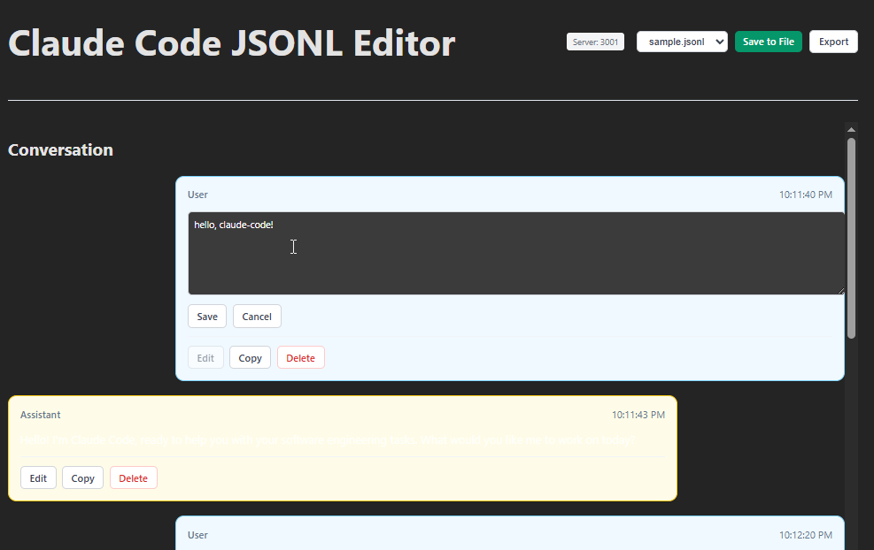

# Claude Code JSONL Editor

🚀 Interactive JSONL editor for Claude Code conversation files with real-time file system synchronization.



## Why? Core Concept & Philosophy

**Efficient Prompt Engineering Through Conversation Editing**

Editing Claude Code logs (JSONL files) makes prompt engineering significantly more efficient through a powerful technique: **output modification**. This approach enables infinite iteration and refinement of AI interactions without starting from scratch.

### The Philosophy

Traditional prompt engineering requires:
1. Write prompt → Get response → Analyze → Rewrite entire prompt → Repeat

Our approach enables:
1. Write prompt → Get response → **Edit the response directly** → Continue conversation → Infinite refinement

### Why This Works

- **Context Preservation**: By editing assistant responses in the conversation log, you maintain the full context while perfecting the output
- **Iterative Refinement**: Transform mediocre responses into perfect ones without losing conversation flow  
- **Prompt Engineering Acceleration**: Test different response styles and approaches by editing outputs, then use successful patterns in future prompts
- **Training Data Creation**: Build high-quality conversation datasets by refining real interactions
- **Debugging Conversations**: Fix errors or improve responses retroactively to understand what works

### Practical Applications

- **Template Creation**: Edit responses to create reusable conversation templates
- **Response Quality Control**: Perfect Claude's outputs for documentation or examples
- **Conversation Branching**: Edit responses to explore different conversation paths
- **Prompt Pattern Discovery**: Identify what response styles work best for specific use cases
- **Knowledge Base Building**: Curate high-quality Q&A pairs from real interactions

By making conversation editing as simple as chat editing, this tool transforms how you work with AI conversations - from linear interactions to iterative masterpieces.

## Features

- 📝 **Interactive Chat Interface** - Edit conversations in a familiar chat-style UI
- 💾 **Real-time File Sync** - Direct file system editing with automatic backups
- 🔧 **Multi-file Support** - Handle single files or entire directories
- ✏️ **Rich Editing** - Edit, copy, delete messages with inline editing
- 🌐 **Network Access** - Expose to network for remote editing
- 🎨 **Beautiful CLI** - Colorful, informative command-line interface
- 🔒 **Safe Operations** - Automatic backup creation before saves

## Installation

### One-Line Install (Recommended)

```bash
curl -fsSL https://raw.githubusercontent.com/anthropics/claude-code-jsonl-editor/main/install.sh | bash
```

After installation, reload your shell or add `~/.local/bin` to your PATH:
```bash
export PATH="$HOME/.local/bin:$PATH"
```

### Manual Installation

```bash
# Clone the repository
git clone https://github.com/anthropics/claude-code-jsonl-editor.git
cd claude-code-jsonl-editor

# Install dependencies
npm install

# Start the application
npm start
```

## Quick Start

```bash
# Start with default samples directory
jsonl-editor

# Start with specific file
jsonl-editor -p ./conversation.jsonl

# Start with directory
jsonl-editor -p ./conversations

# Expose to network
jsonl-editor --expose
```

## Upgrading

```bash
# Using the same install command will upgrade existing installation
curl -fsSL https://raw.githubusercontent.com/anthropics/claude-code-jsonl-editor/main/install.sh | bash
```

## Uninstalling

```bash
# Download and run uninstall script
curl -fsSL https://raw.githubusercontent.com/anthropics/claude-code-jsonl-editor/main/uninstall.sh | bash

# Or if you have the repository
bash uninstall.sh
```

## CLI Options

```bash
jsonl-editor [options]

Options:
  -p, --jsonl-path <path>    Path to JSONL file or directory
  -P, --port <port>          Server port (default: 3001)  
  --client-port <port>       Client port (default: 5173)
  --host <host>              Host to bind to (default: localhost)
  --expose                   Expose to network (same as --host 0.0.0.0)
  --no-backup                Disable automatic backup creation
  --server-only              Start only the server
  --client-only              Start only the client  
  -v, --verbose              Enable verbose logging
  -q, --quiet                Suppress non-error output
  -h, --help                 Display help information
```

## Examples

```bash
# Start with default samples
jsonl-editor

# Edit specific file
jsonl-editor -p ./conversation.jsonl

# Edit directory of files  
jsonl-editor -p ./jsonl-files

# Network access
jsonl-editor -p ./data --expose
jsonl-editor -p ./data --host 192.168.1.100

# Custom ports
jsonl-editor -p ./data --port 4000 --client-port 8080

# Server only mode
jsonl-editor -p ./data --server-only

# Verbose logging
jsonl-editor -p ./data -v
```

## Project Structure

```
claude-code-jsonl-editor/
├── src/                    # Frontend source
│   ├── components/        # React/Preact components
│   ├── utils/            # Utilities and parsers
│   └── types.ts          # TypeScript definitions
├── samples/              # Default sample files
├── public/               # Static assets
├── server.js             # Express API server
├── start.js              # CLI entry point
└── package.json          # Project configuration
```

## Development

```bash
# Start development with file watching
npm run dev

# Build for production
npm run build

# Run server only
npm run server

# Run client only  
npm run client
```

## API Endpoints

- `GET /api/config` - Get server configuration
- `GET /api/files` - List available files
- `GET /api/files/:filename` - Read file content
- `POST /api/files/:filename` - Save file content

## File Format

The editor works with Claude Code JSONL files containing conversation entries:

```jsonl
{"type":"summary","summary":"General Project Development","leafUuid":"..."}
{"type":"user","message":{"role":"user","content":"Hello, claude-code!"},"uuid":"...","timestamp":"..."}
{"type":"assistant","message":{"role":"assistant","content":"Hello! How can I help?"},"uuid":"...","timestamp":"..."}
```

## License

MIT License - see LICENSE file for details.

## Contributing

1. Fork the repository
2. Create a feature branch
3. Make your changes  
4. Add tests if applicable
5. Submit a pull request

## Support

- 📖 Documentation: See inline help with `jsonl-editor --help`
- 🐛 Issues: Report bugs on GitHub Issues
- 💬 Discussions: GitHub Discussions for questions

---

Built with ❤️ for the Claude Code community